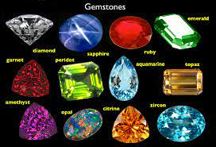
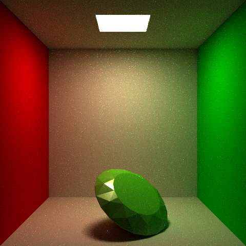

# Rendering Gems by Scott Lee

# Project Proposal

I was first interested in implementing the interaction between gems and aurora borealis, but after doing some preliminary research it would have been too much to handle alone given the timespan. So, I decided to simply focus on rendering gems and implementing the research from this [paper](https://dl.acm.org/doi/10.1145/1015706.1015708). 

## What I've Implemented So Far

I was able to find a free diamond model on [cgtrader](https://www.cgtrader.com/free-3d-models/scripts-plugins/modelling/low-poly-diamond-6899deeb-29ce-4d74-aa69-cc5d6418a390). From there I incorporated [tinyobjloader](https://github.com/tinyobjloader/tinyobjloader) into my code to work together with the parser used in previous assignments. I added a new command for the test scenes: 

`obj pathToObjFile`

This allows me to utilize previous scenes and reuse transformation and material command formats. This also makes it easier to add multiple obj files to one scene. The images below are of the diamond model referenced earlier using different transformations inside the cornell box defined in previous assignments.

### Images
The images below use 128 samples per pixel and multiple important sampling. 

## Next Steps

- Implement refraction using [photon mapping](https://graphics.stanford.edu/courses/cs348b-00/course8.pdf) to allow for next event estimation.
- Implement physically accurate absorption.
- Implement extraordinary rays for anisotropic gems such as sapphire. Anisotropic gems split refracted rays into two separate rays as shown in the image below:

Image from [SIGGRAPH 04: Graphics gems revisited](https://dl.acm.org/doi/10.1145/1015706.1015708).

My hope is to at least implement photon mapping and absorption mentioned above. Trying to implement extraordinarys may be challenging since the number of rays will increase exponentially. Furthermore I expect to incorporate more models in the scenes to test different intereactions with refractions. 

# Resources
 - [SIGGRAPH 04: Graphics gems revisited](https://dl.acm.org/doi/10.1145/1015706.1015708)
 - [Photon Mapping](https://graphics.stanford.edu/courses/cs348b-00/course8.pdf)
 - [tinyobjloader](https://github.com/tinyobjloader/tinyobjloader)
